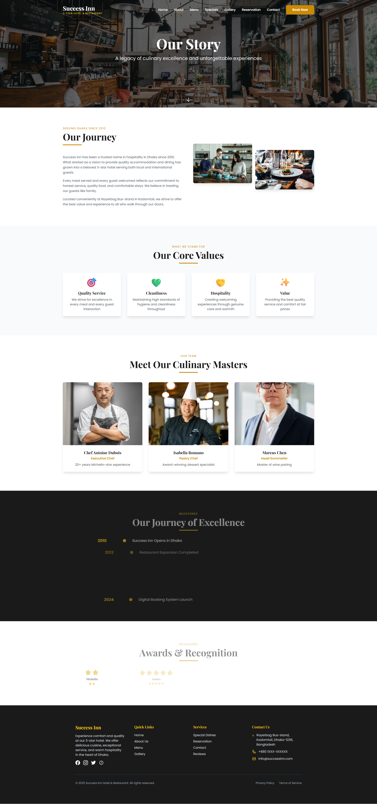
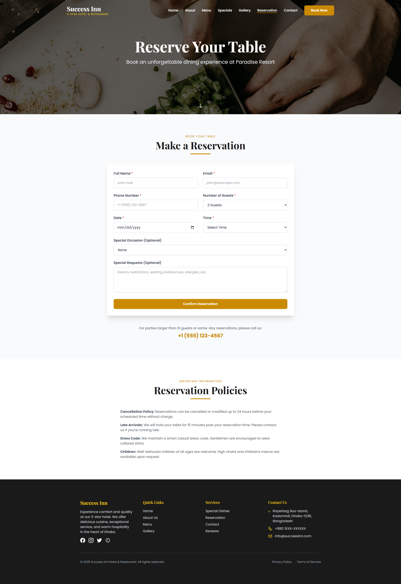
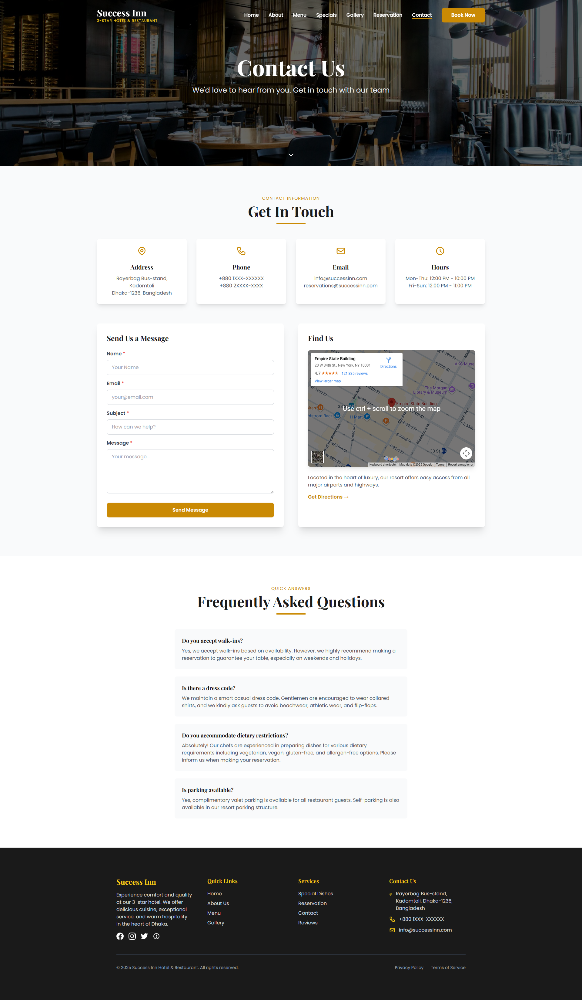

# Success Inn - 3-Star Hotel & Restaurant Frontend

A complete, modern, mobile-responsive React frontend for Success Inn, a 3-star hotel and restaurant in Dhaka, Bangladesh.

## 🌐 Live Demo

**[View Live Site](https://success-inn-resort.netlify.app/)**

## 📸 Screenshots

### Home Page


### About Page


### Menu Page


### Specials Page


### Gallery Page


### Reservation Page


### Contact Page


### Reviews Page


## 🌟 Features

- **Modern React + Vite**: Built with React 19 and Vite for lightning-fast development
- **Beautiful UI/UX**: Luxury-themed design with soft gold, white, dark green, and black accents
- **Fully Responsive**: Mobile-first design that works seamlessly on all devices
- **Smooth Animations**: Powered by Framer Motion for elegant transitions and effects
- **Complete Pages**:
  - Home - Hero section with featured dishes and testimonials
  - About - Hotel story, team, values, and milestones
  - Menu - Filterable menu with categories and detailed item modals
  - Specials - Today's special dishes and experiences
  - Gallery - Beautiful image gallery with hotel rooms and category filters
  - Reservation - Comprehensive booking form with validation
  - Contact - Contact form with map integration and FAQ
  - Reviews - Customer testimonials with ratings and filters

## 🛠️ Tech Stack

- **React 19** - UI library
- **Vite 5** - Fast build tool and dev server
- **React Router 7** - Navigation and routing
- **Tailwind CSS 3** - Utility-first CSS framework
- **Framer Motion 12** - Animation library
- **Swiper 12** - Touch slider for testimonials
- **Axios** - HTTP client for API calls

## 📁 Project Structure

```
resort-restaurant-frontend/
├── src/
│   ├── components/         # Reusable components
│   │   ├── Navbar.jsx
│   │   ├── Footer.jsx
│   │   ├── Button.jsx
│   │   ├── Card.jsx
│   │   ├── SectionHeader.jsx
│   │   ├── HeroSection.jsx
│   │   └── Modal.jsx
│   ├── pages/             # Page components
│   │   ├── Home.jsx
│   │   ├── About.jsx
│   │   ├── Menu.jsx
│   │   ├── Specials.jsx
│   │   ├── Gallery.jsx
│   │   ├── Reservation.jsx
│   │   ├── Contact.jsx
│   │   └── Reviews.jsx
│   ├── data/              # JSON data files
│   │   ├── menu.json
│   │   ├── specials.json
│   │   ├── gallery.json (7 hotel room photos)
│   │   └── testimonials.json
│   ├── services/          # API services
│   │   ├── api.js
│   │   └── index.js
│   ├── App.jsx
│   ├── index.jsx
│   └── index.css
├── index.html             # Root HTML (Vite)
├── vite.config.js         # Vite configuration
├── tailwind.config.js
└── package.json
```

## 🚀 Getting Started

### Installation

```bash
npm install
```

### Development Server

```bash
npm run dev
```

Open [http://localhost:3000](http://localhost:3000) to view it in your browser.

### Build for Production

```bash
npm run build
```

### Preview Production Build

```bash
npm run preview
```

## 🎨 Design Features

### Color Palette
- **Gold**: `#ca8a04` - Primary accent
- **Luxury Dark**: `#1a1a1a` - Text and backgrounds
- **Luxury Green**: `#2d5016` - Accent
- **Luxury Cream**: `#f5f5dc` - Background variations

### Typography
- **Headings**: Playfair Display (serif)
- **Body**: Poppins (sans-serif)

## 📱 Pages Overview

- **Home**: Hero, features, featured dishes, testimonials, CTA
- **About**: Hotel story since 2010, values, team, timeline
- **Menu**: Filterable menu with detailed modals
- **Specials**: Today's special dishes and experiences
- **Gallery**: 7 hotel room photos + restaurant, food, events
- **Reservation**: Booking form with validation
- **Contact**: Address (Rayerbag Bus-stand, Kadomtoli, Dhaka-1236), contact form, FAQ
- **Reviews**: Customer testimonials with ratings

## 🏨 Success Inn Details

- **Location**: Rayerbag Bus-stand, Kadomtoli, Dhaka-1236, Bangladesh
- **Rating**: 3-Star Hotel
- **Services**: Quality Dining & Comfortable Accommodation
- **Email**: info@successinn.com

## 🔧 Customization

### Update API Endpoint
Edit `src/services/api.js`:
```javascript
baseURL: 'YOUR_API_URL_HERE'
```

### Modify Theme
Edit `tailwind.config.js` to change colors and styles.

### Update Data
Modify JSON files in `src/data/` directory.

## 📦 Available Scripts

- `npm run dev` - Run Vite development server (fast HMR)
- `npm run build` - Build for production
- `npm run preview` - Preview production build

## ⚡ Why Vite?

- **Instant Server Start**: No bundling required in development
- **Lightning Fast HMR**: Hot Module Replacement is instant
- **Optimized Build**: Uses Rollup for production builds
- **Better Performance**: 10-100x faster than Create React App

## 🔗 API Integration

Service modules ready for backend integration:
- Menu, Specials, Gallery, Testimonials, Reservations, Contact

Currently using local JSON data but easily adaptable to real APIs.

---

Built with ❤️ using React 19, Vite 5, Tailwind CSS 3, and Framer Motion 12.
